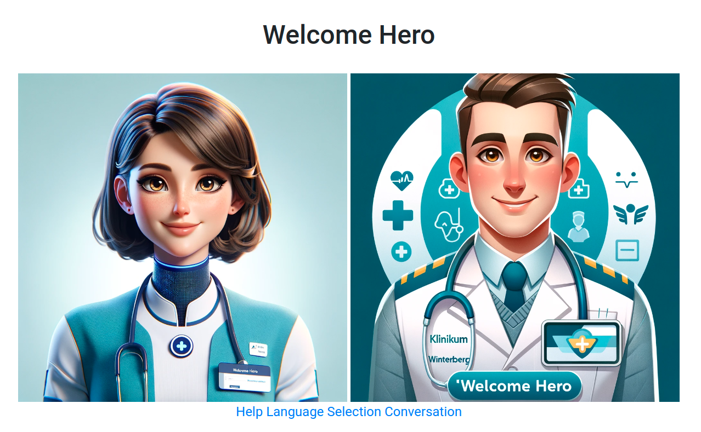

Welcome Hero Prototype
----



_Welcome Hero_ is an AI-supported information kiosk to support visitors, patients, and staff in the context of a hospital.

The aim was to provide the audience with an easy way to overcome language barriers and quickly obtain information.

_Welcome Hero_ is a web-based kiosk solution that allows users to select their language and then use voice control 
to obtain various information about a hospital and the surrounding area based an customizable knowledge-base in their native language. 
The system can then respond with text and speech in the selected language.

Demonstrated use cases are
- Orientation aid for visitors: "Where can I find the obstetrics ward"?
- Practical information for patients: "Can I pay by card in the car park?"
- Convenience for employees: What is the vegetarian dish in the cafeteria today?

The possible applications of this system are, of course, not limited to hospitals; other possibilities include
- City/municipality: Citizen info kiosk in municipal facilities
- School: Making information more easily accessible for refugee pupils
- Public transport: Information on tickets -> Which ticket is right for me to get from A to B?

Note that although the current prototype uses cloud-based services, an actual implementation 
would work completely fine with locally self-hosted AI models, which would be the preferred way 
to use this system for the sake of user privacy.

# Demo

[](https://www.youtube.com/watch?v=7tFBhrh3o8Y "Welcome Hero Demo")

# Context

The project was developed during the first [Quattropole Health Hackathon (2023)](https://healthhackathon.quattropole.org/), 
which took place simultaneously in the four cities of Saarbrücken, Luxembourg, Trier, and Metz from 1 Dec - 2 Dec. In 16 hours, 
the team developed the concept and built an executable prototype. 

The cross-functional team around Louise, Nina, Jake, Florian, Sebastian, and Thomas consisted of three bilingual students 
of the [DFHI](https://www.dfhi-isfates.eu/de/ueber-das-dfhi/) (Business Administration French / German), 
two app developers (Android, Flutter), and a web developer won the special €1000 prize of the supra-regional 
Quattropole Challenge for the solution that is most generally applicable across all regions.

# Tech 

The application consists of a Java based backend build with [Spring Boot](https://spring.io/projects/spring-boot) and uses [Spring AI](https://docs.spring.io/spring-ai/reference/index.html) 
to leverage the [Speech to Text](https://platform.openai.com/docs/guides/speech-to-text), [Translation and Text Generation](https://platform.openai.com/docs/guides/text-generation) capabilities of [OpenAI](https://openai.com/).

The frontend uses HTML, JavaScript, CSS and Bootstrap and some Browser APIs to perform the 
speech recording.

# Setup
You need to obtain an [OpenAI API Key](https://openai.com/blog/openai-api) to run the example.

# Build

```
mvn clean package -DskipTests
```

# Run

```
export SPRING_AI_OPENAI_API_KEY="xxxx"
java -jar target/*.jar
```

Once running, you can access the application via http://localhost:8080.
